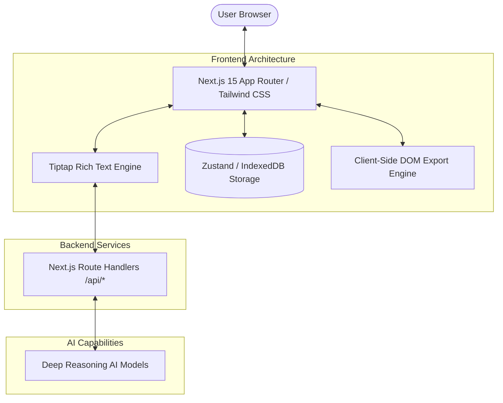
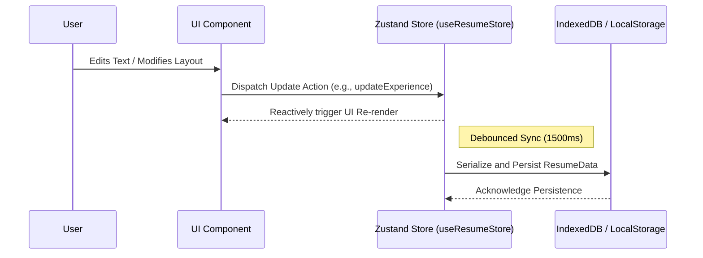

<div align="center">


# Jobly Resume Editor

[](https://opensource.org/licenses/Apache-2.0)


A modern, highly-performant online resume editor that makes creating professional resumes simple, intuitive, and efficient. Optimized for Vercel and built with the latest Next.js 15 App Router, it features real-time client-side previews, Deep Reasoning AI assistance, and robust, privacy-first flexible export capabilities.

</div>

---

## 📖 Table of Contents

- [Overview](#-overview)
- [Key Features](#-key-features)
- [Technical Architecture](#-technical-architecture)
  - [High-Level System Design](#high-level-system-design)
  - [State Management & Data Flow](#state-management--data-flow)
  - [Client-Side Rendering & Export Flow](#client-side-rendering--export-flow)
- [Getting Started](#-getting-start)
  - [Prerequisites](#prerequisites)
  - [Installation](#installation)
  - [Development](#development)
- [Deployment](#-deployment)
- [Licensing and Commercial Use](#-licensing-and-commercial-use)
- [Roadmap](#-roadmap)
- [Contact](#-contact)

---

## 🌟 Overview

Jobly is crafted to provide a native-like application experience directly within your web browser. By combining the power of the React ecosystem with an intuitive UI and AI-driven enhancements, it streamlines the process of writing, formatting, and exporting a resume. It operates entirely client-side for its core functionalities, ensuring that personal data remains entirely within the user's local environment unless explicitly interacting with the AI services.

---

## ✨ Key Features

- **Deep Reasoning AI Integration**: Utilizes advanced, highly capable AI models to polish your writing, perform grammar checks, and extract insights. It acts as an embedded personal resume consultant to elevate the impact of your work experiences.
- **Privacy-First Client-Side Rendering Engine**: Unlike traditional editors that rely on heavy backend services to generate documents, Jobly features a 100% Next.js-driven rendering engine. Exports to **PDF, JSON, and Markdown** are generated entirely within the browser DOM. This guarantees maximum privacy and zero network latency.
- **Real-Time Data Persistence (Local-First)**: Your progress is automatically and instantly saved to your local browser storage using IndexedDB and Zustand. This ensures no data loss, allows for offline editing capabilities, and requires no user account to get started.
- **Modern Tech Stack**: Built from the ground up with **Next.js 15, TypeScript, Tailwind CSS v3, Radix UI, and Tiptap Editor** for a seamless, type-safe, and highly customizable editing experience.
- **Responsive & Accessible**: Fully functional across desktop and tablet devices with a built-in, seamlessly integrated Dark Mode. Fluid UI transitions are powered by Framer Motion.
- **Auto One-Page Optimizer**: Intelligently adjusts layout padding, section gaps, and font scaling to ensure your resume fits perfectly on a single A4 page.

---

## 🏗️ Technical Architecture

Jobly's architecture is divided into clear logical boundaries to ensure maintainability, performance, and scalability. Below are diagrams illustrating how the system operates under the hood.

### High-Level System Design

This diagram outlines the primary interaction between the user, the frontend application, the minimal backend route handlers, and external AI providers.



### State Management & Data Flow

Data integrity is critical for an editor. Jobly utilizes a reactive state model with Zustand, persisting changes locally to prevent data loss while providing real-time feedback to the UI.



### Client-Side Rendering & Export Flow

The PDF generation process completely bypasses the need for an external server, utilizing the browser's native print capabilities and DOM cloning.

```mermaid
flowchart LR
    Start([User clicks Export PDF]) --> Clone[Clone React DOM Node]
    Clone --> Optimize[Optimize CSS Rules & Strip Animations]
    Optimize --> Inline[Convert Remote Images to Base64]
    Inline --> Inject[Inject Print-Specific Styles]
    Inject --> NativePrint[Trigger Browser window.print()]
    NativePrint --> End([Save as PDF])
    
    style Start fill:#f9f,stroke:#333,stroke-width:2px
    style End fill:#bbf,stroke:#333,stroke-width:2px
```

---

## 🚀 Getting Started

Follow these instructions to set up the project locally for development and testing.

### Prerequisites

Ensure you have the following installed on your local machine:
- Node.js 18.17.0 or higher
- `pnpm` (Node Package Manager)

### Installation

1. **Clone the repository**
```bash
git clone https://github.com/cuda-cookie/jobly-k01-.git
cd jobly-k01-
```

2. **Install dependencies**
```bash
pnpm install
```

3. **Configure Environment Variables**
Copy the example environment file to create your local `.env` file. You will need to configure your API keys to enable the Deep Reasoning AI features.
```bash
cp .env.example .env
```
*(Open `.env` and add your specific configuration values)*

### Development

Start the local Next.js development server:

```bash
pnpm dev
```
Open your browser and navigate to `http://localhost:3000`. The application will automatically reload if you change any of the source files.

---

## 📦 Deployment

Jobly is highly optimized for deployment on **Vercel**, taking full advantage of Next.js Edge capabilities and Route Handlers.

1. Push your code to a GitHub repository.
2. Import the project into Vercel.
3. Set your Environment Variables in the Vercel project settings.
4. Deploy!

To build the project locally to test production output:
```bash
pnpm build
pnpm start
```

---

## 📝 Licensing and Commercial Use

The source code of this project is open-sourced under the **Apache 2.0** license, but with **strict commercial use restrictions**:

- **Free for Personal Use**: You are free to use this application purely for personal, non-commercial purposes, such as creating, managing, and exporting your own resumes.
- **Commercial License Required**: Unauthorized commercial use is strictly prohibited. Any organization or individual intending to provide this as a service (SaaS/PaaS) to the public for profit, integrate it into enterprise operations, or conduct secondary commercial development **must obtain a commercial license**. This restriction applies regardless of whether the source code has been modified.

---

## 🗺️ Roadmap

- [x] Integrate Deep Reasoning AI for text refinement and grammar checking
- [x] Migrate to Next.js 15 App Router architecture for enhanced performance
- [x] Implement 100% Client-side PDF generation (zero server dependency)
- [x] Implement Auto One-Page optimization logic
- [ ] Add a wider variety of professional and creative templates
- [ ] Support importing from existing PDF or Markdown files
- [ ] Implement optional cloud synchronization via OAuth providers

---

## 📞 Contact

For inquiries regarding commercial licenses, business partnerships, or dedicated support, please contact the maintainers via the repository issues or through official channels provided in the repository.
