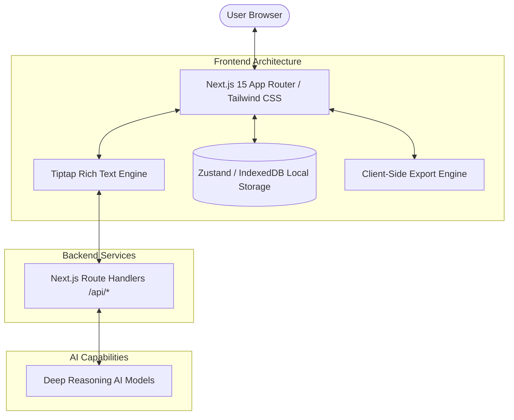

<div align="center">


# Jobly Resume Editor

[](https://opensource.org/licenses/Apache-2.0)


A modern, highly-performant online resume editor that makes creating professional resumes simple and efficient. Optimized for Vercel and built with Next.js 15 and Framer Motion, it features real-time client-side preview, deep reasoning AI assistance, and flexible export capabilities.

</div>

---

## Technical Overview

Jobly is designed to provide a native-like application experience in the browser. By leveraging the latest Next.js App Router and Zustand for state management, it ensures that your data is handled efficiently and securely.

### Architecture



## Key Features

- **Deep Reasoning AI Integration**: Utilizes advanced AI models to polish your writing, check grammar, and extract insights, acting as your personal resume consultant.
- **Client-Side Rendering Engine**: Features a 100% Next.js-driven rendering engine. Exports to PDF, JSON, and Markdown are generated entirely within the browser for maximum privacy and zero latency.
- **Real-Time Data Persistence**: Your progress is automatically saved to your local browser storage using IndexedDB, ensuring no data loss without requiring an account.
- **Modern Tech Stack**: Built with Next.js 15, TypeScript, Tailwind CSS, Radix UI, and Tiptap Editor for a seamless editing experience.
- **Responsive & Accessible**: Fully functional across devices with built-in dark mode and fluid animations powered by Framer Motion.
- **Auto One-Page Optimizer**: Intelligently adjusts layout and spacing to ensure your resume fits perfectly on a single page.

## Quick Start

1. Clone the repository
```bash
git clone https://github.com/cuda-cookie/jobly-k01-.git
cd jobly-k01-
```

2. Install dependencies
```bash
pnpm install
```

3. Configure Environment Variables
Copy `.env.example` to `.env` and configure any necessary API keys for the AI capabilities.

4. Start the development server
```bash
pnpm dev
```
Open your browser and visit `http://localhost:3000`.

## Build and Deploy

Jobly is optimized for seamless deployment on Vercel. Connect your GitHub repository to Vercel for automated deployments.

```bash
pnpm build
pnpm start
```

## License and Commercial Use

The source code of this project is open-sourced under the **Apache 2.0** license, subject to the following **commercial use restrictions**:

- **Free for Personal Use**: You are free to use this application purely for personal, non-commercial purposes, such as creating and managing your own resumes.
- **Commercial License Required**: Unauthorized commercial use is strictly prohibited. Any organization or individual intending to provide this as a service (SaaS/PaaS) to the public for profit, integrate it into enterprise operations, or conduct secondary commercial development must obtain a commercial license. This applies regardless of whether the source code has been modified.

## Roadmap

- [x] Integrate Deep Reasoning AI for text refinement
- [x] Migrate to Next.js 15 App Router architecture
- [x] Client-side PDF generation and printing
- [x] Implement Auto One-Page optimization
- [ ] Add more professional templates
- [ ] Support for importing from existing PDF/Markdown files
- [ ] Cloud synchronization and hosting options

## Contact

For inquiries regarding commercial licenses, partnerships, or support, please contact the maintainers via the repository issues or through official channels.