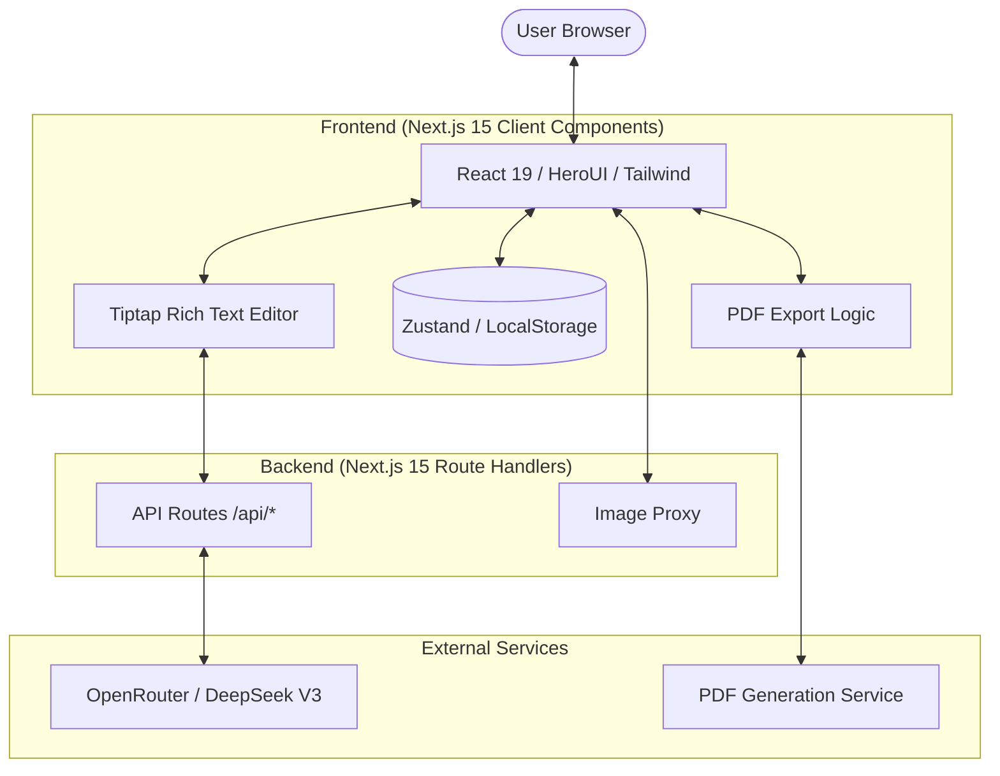

<div align="center">

# ✨ Jobly ✨

[](https://opensource.org/licenses/Apache-2.0)


Jobly is a modern online resume editor that makes creating professional resumes simple and enjoyable. Optimized for Vercel and built with Next.js 15 and Framer Motion, it supports real-time preview and custom themes.

</div>

## 📸 Screenshots


## ✨ Features

- 🚀 Built with Next.js 15 (App Router)
- 💫 Smooth animations (Framer Motion)
- 🎨 Custom theme support
- 📱 Responsive design
- 🌙 Dark mode
- 📤 Export to PDF
- 🔄 Real-time preview
- 💾 Auto-save
- 🔒 Local storage

## 🛠️ Tech Stack

- Next.js 15
- TypeScript
- Tailwind CSS
- Zustand
- Radix UI / HeroUI
- Tiptap Editor
- Lucide Icons

## 📐 Technical Architecture



## 🚀 Quick Start

1. Clone the project

```bash
git clone https://github.com/cuda-cookie/jobly-k01-.git
cd jobly-k01-
```

2. Install dependencies

```bash
pnpm install
```

3. Start development server

```bash
pnpm dev
```

4. Open browser and visit `http://localhost:3000`

## 📦 Build and Deploy

Jobly is optimized for Vercel deployment. Simply connect your GitHub repository and it will deploy automatically.

```bash
pnpm build
```

## 📝 License and Commercial Use

The source code of this project is open-sourced under the **Apache 2.0** license, but with **strict commercial use restrictions**:

- **Free for Personal Use**: Free to use purely for personal, non-commercial purposes (e.g., personal learning, creating your own resume).
- **Commercial License Required**: Unauthorized commercial use is strictly prohibited. Any organization or individual that provides it as a service (SaaS/PaaS, etc.) to the public for profit, uses it for enterprise commercial operations, or conducts secondary commercial development, **must obtain a commercial license, regardless of whether the source code has been modified**.

## 🗺️ Roadmap

- [x] AI-assisted writing (OpenRouter / DeepSeek)
- [x] Modern Next.js 15 architecture
- [ ] Support for more resume templates
- [ ] Support for more export formats
- [ ] Import PDF, Markdown, etc.
- [x] Auto one page
- [ ] Online resume hosting

## 📞 Contact

For any inquiries or commercial licenses, please contact the maintainers via the repository issues or your preferred contact method.
